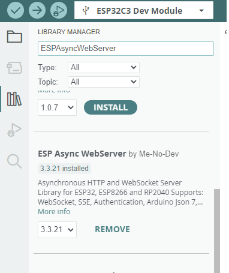
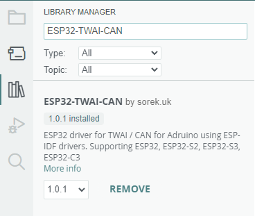
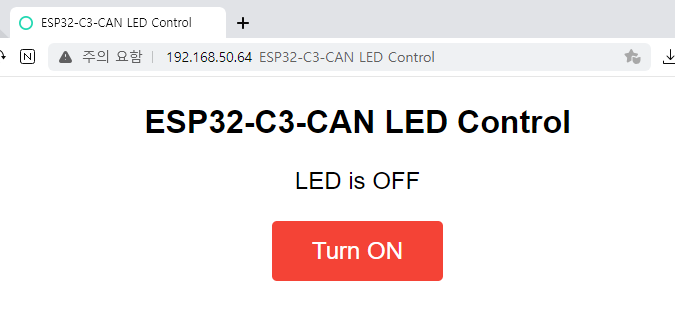
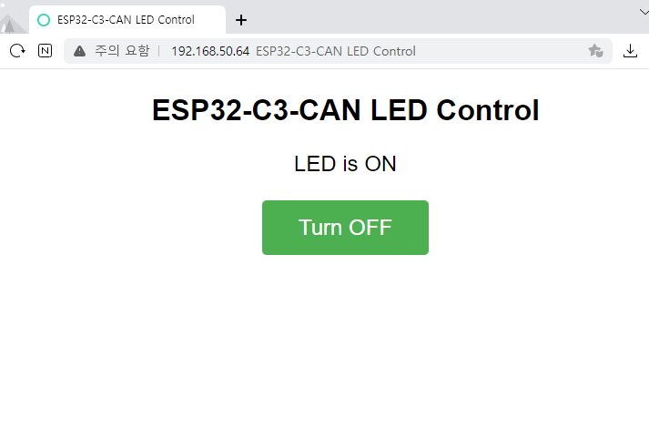

## ESP32-C3-CAN 예제

### 필요 라이브러리 설치
#### ESPAsyncWebServer bt Me-No-Dev

#### ESP32-TWAI-CAN

### 코드상 와파이 설정
WiFiServer_and_can_led_control.ino 에서 아래의 내용을 자신의 와이파이 공유 정보로 변경

    const char* ssid = "...";
    const char* password = "...";

### CAN 통신 설명
속도: 500kbps 
LED 상태 정보:  

    1000ms 단위로 ESP32-CLASSIC-CAN 모듈이 전송
    ID: 0x500
    DATA[0]: ms 단위 증가
    DATA[1]: LED 상태(0: OFF, 1: ON)

LED 설정 변경:  

    ID: 0x501    
    DATA[0]: LED 변경(0: Toggle, 1: ON, 2: OFF)

WEBServer 접속

    ESP32-CLASSIC-CAN의 IP 주소는 시리얼 모니터로 확인 가능
    

