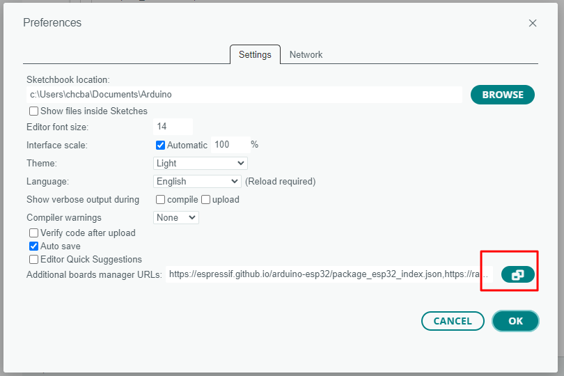
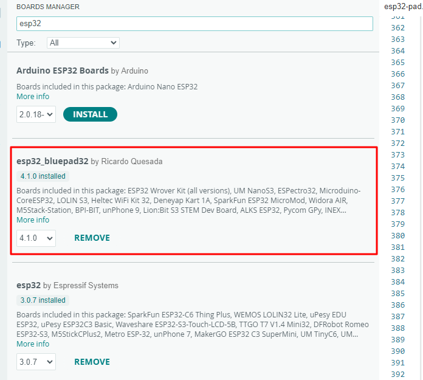
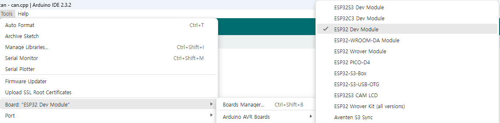
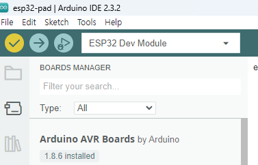
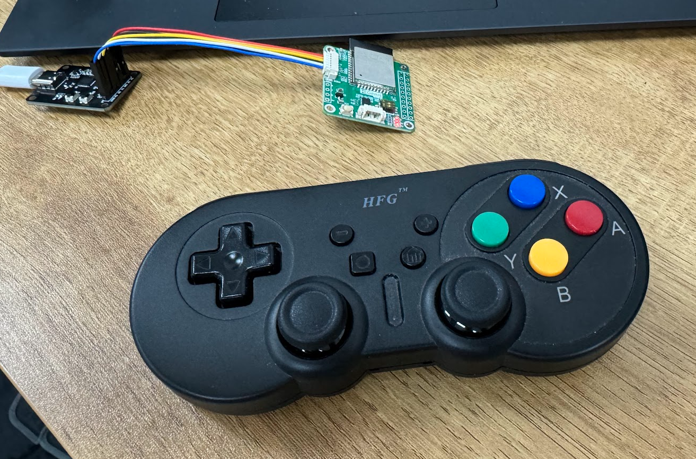

## ESP32-PAD 게임 컨트롤러를 이용한 메카넘 휠 동작 예제

https://youtu.be/MMp8XyFow5c

### ESP32_bluepad32 보드 설치 설치
#### 보드 매니저 URL 추가
File > Preferences에서 아래의 링크를 추가 합니다.

    https://raw.githubusercontent.com/ricardoquesada/esp32-arduino-lib-builder/master/bluepad32_files/package_esp32_bluepad32_index.json

### esp32_bluepad32 보드 설치
Boards Manager를 열어 esp32를 검색해 eps32_bluepad32를 설치합니다.

### 보드 선택
Tools > Board > eso32_bluepad32 > ESP32 Dev Module을 선택합니다.

### 기능 설명

- 버튼 3초 이상 누르면 연결 대기 상태 → LED 빠르게 깜빡임
- 이 상태에서 게임패드를 페어링 모드 실행
- 연결이 되면 LED는 ON이 되고 키 입력이 될때 마다 LED 점멸함
- 만약 연결이 끊어지면 LED는 500ms 마다 점멸함
